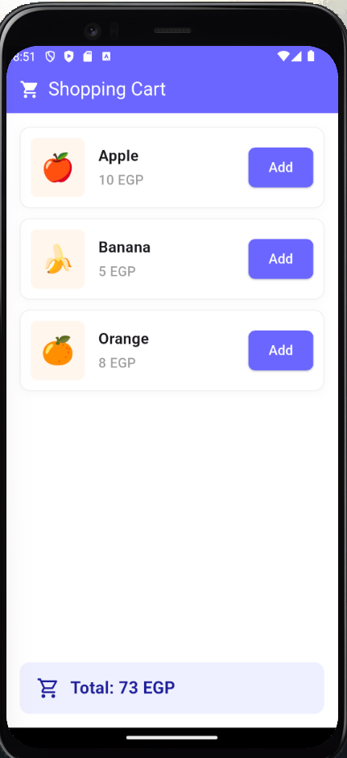

<h1 align="center">🛒 Shopping Cart App</h1>

<p align="center">
  
  
  
</p>

<p align="center">
  تطبيق سلة مشتريات مبني بـ Flutter يوضح كيفية إدارة الحالة (State Management) باستخدام <b>Provider</b> مع تطبيق هيكلية <b>Feature-Based Architecture</b>.
</p>

---

## 📸 الواجهة (Screenshots)
<!-- تنبيه: لكي تظهر الصورة، قم بإنشاء مجلد باسم screenshots بجوار مجلد lib، وضع بداخله صورة التطبيق باسم app_ui.png -->
<div align="center">

</div>

## ✨ المميزات (Features)
- ⚡ **إدارة الحالة (State Management):** التحديث الفوري للمجموع الكلي باستخدام `Provider` بدون الحاجة لاستخدام `setState`.
- 🏗️ **Clean Architecture:** تقسيم المشروع إلى (Models, Providers, Widgets, Screens, Theme) لسهولة الصيانة والتطوير.
- 🎨 **تصميم مخصص:** الاعتماد على ملف `AppColors` كمرجع مركزي لإدارة ألوان التطبيق.
- 🚀 **كود نظيف:** فصل واجهة المستخدم (UI) عن منطق العمل (Business Logic) لاحترافية أعلى في كتابة الكود.

## 📂 هيكل المشروع (Folder Structure)
```text
lib/
├── core/
│   └── theme/
│       └── app_colors.dart
├── features/
│   └── cart/
│       ├── models/
│       │   └── product_model.dart
│       ├── providers/
│       │   └── cart_provider.dart
│       ├── widgets/
│       │   ├── product_item_widget.dart
│       │   └── cart_total_bottom_bar.dart
│       └── screens/
│           └── shopping_cart_screen.dart
└── main.dart
